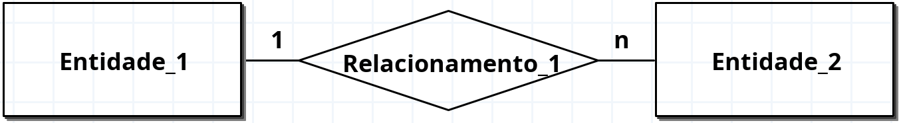
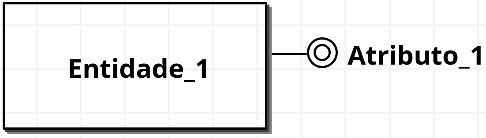
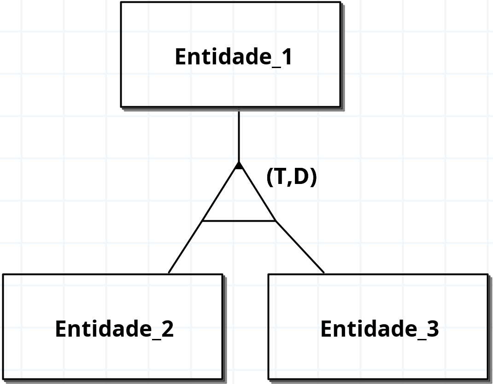

# brModelo - Adaptado para Metodologia de Ensino

Este fork contém modificações e implementações realizadas para adequar o projeto [brModelo](https://github.com/chcandido/brModelo) à metodologia de ensino de modelagem de banco de dados utilizada em sala de aula, permitindo manter a mesma forma de representação escrita ao documentar digitalmente pelo software.

Estas alterações visam proporcionar maior adequação à metodologia de ensino de modelagem de banco de dados utilizada em sala de aula, permitindo representações mais precisas conforme a abordagem do professor.

### Alterações implementadas:

1. **Implementação das cardinalidades: 1 e N**
   - Adição de novos tipos de cardinalidade: C1 (um) e CN (muitos)
   - Estes novos tipos permitem uma forma de representação das cardinalidades sem necessariamente utilizar do padrão de mínimo e máximo

<div align="center"></div>

2. **Alteração da representação do atributo multivalorado**
   - Implementação de atributo multivalorado com representação visual (círculo interno)
   - Ajuste para melhor interação com atributos multivalorados

<div align="center"></div>

3. **Implementação de especialização com texto arrastável**
   - Representação do tipo de especialização: (T,D), (T,S), (P,D), (P,S)
   - Texto separado do triângulo, permitindo arrastar e redimensionar
<div align="center"></div>

---

## Download

Para baixar a versão mais recente do brModelo, accesse a página de [Releases](https://github.com/gustavogordoni/brModelo/releases) e baixe o arquivo `brModelo.jar` mais recente.

Alternativamente, você pode baixar diretamente o arquivo JAR da versão mais recente:

**[Baixar brModelo.jar](https://github.com/gustavogordoni/brModelo/releases/download/especializa%C3%A7%C3%A3o/brModelo.jar)**

## Como executar

Após baixar o arquivo `brModelo.jar`, execute-o com o Java:

```bash
java -jar brModelo.jar
```

---

### Lista de implementações futuras

- [x] Definir restrição de participação e generalização na hierarquia: (T, D), (T, S), (P, D), (P, S).
- [ ] Implementar representação de agregação
- [ ] Outras adaptações conforme necessidade da metodologia

---

Para mais informações sobre o projeto original, consulte o [repositório oficial](https://github.com/chcandido/brModelo).
